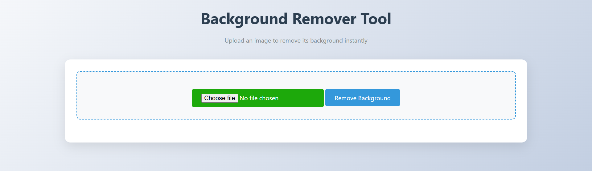
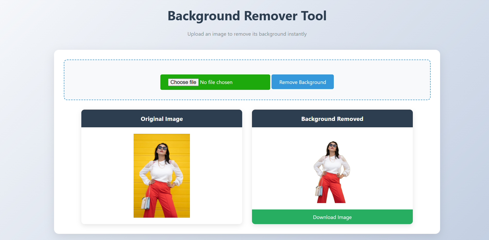

````markdown
# Background Remover Web App


A **Flask-based web application** to remove the background from images using the **Rembg library**.  
This app uses a **lightweight U2Net model (`u2netp`)** for faster processing and provides an option to download the processed image.

---

## Features

- Upload an image and automatically remove its background.
- Preview the original and processed images directly in the browser.
- Download the background-removed image as a PNG.
- Automatic resizing of large images (max 2048x2048) to reduce memory usage.
- Lightweight and fast background removal using `u2netp`.
- Optional full-page screenshot capture of the website.

---

## Demo

  
*Original Image*  

  
*Background Removed*

---

## Installation

1. **Clone the repository:**

```bash
git clone https://github.com/yourusername/background-remover.git
cd background-remover
````

2. **Create a virtual environment:**

```bash
python -m venv venv
```

3. **Activate the virtual environment:**

* Windows:

```bash
venv\Scripts\activate
```

* Mac/Linux:

```bash
source venv/bin/activate
```

4. **Install dependencies:**

```bash
pip install -r requirements.txt
```

---

## Usage

1. Run the Flask application:

```bash
python app.py
```

2. Open your browser and go to:

```
http://localhost:5000
```

3. Upload an image to remove the background.
4. Preview the result and click **Download** to save the processed image.

---

## Screenshots

| Original Image                        | Background Removed                |
| ------------------------------------- | --------------------------------- |
|  |  |

> You can capture full-page screenshots using browser tools:
>
> * **Chrome DevTools:** `Ctrl + Shift + P` → "Capture full size screenshot"
> * **Firefox:** Right-click → "Take Screenshot" → "Save full page"
> * **Automated tools:** Selenium, Puppeteer, etc.

---

## Project Structure

```
background-remover/
│
├─ app.py                 # Main Flask application
├─ templates/
│   └─ index.html         # HTML template for uploading and previewing images
├─ static/
│   └─ css/               # Optional CSS for styling
├─ requirements.txt       # Python dependencies
├─ screenshots/           # Placeholder screenshots for README
└─ README.md              # This file
```

---

## Dependencies

* [Flask](https://pypi.org/project/Flask/)
* [Rembg](https://pypi.org/project/rembg/)
* [Pillow](https://pypi.org/project/Pillow/)

Install all dependencies via:

```bash
pip install flask rembg pillow
```

---

## Notes

* The app uses the **lighter U2Net model (`u2netp`)** by default. Switch to `u2net` for higher accuracy.
* Images larger than 2048x2048 pixels are automatically resized.
* Garbage collection is applied to handle memory efficiently during processing.

---

## License

This project is open-source under the **MIT License**.

---

## Author

Borno | Computer Science & Engineering | Bangladesh

```

---

If you want, I can **also create a ready-to-push `screenshots` folder with placeholder images** so your GitHub repo looks complete and professional.  

Do you want me to do that next?
```
